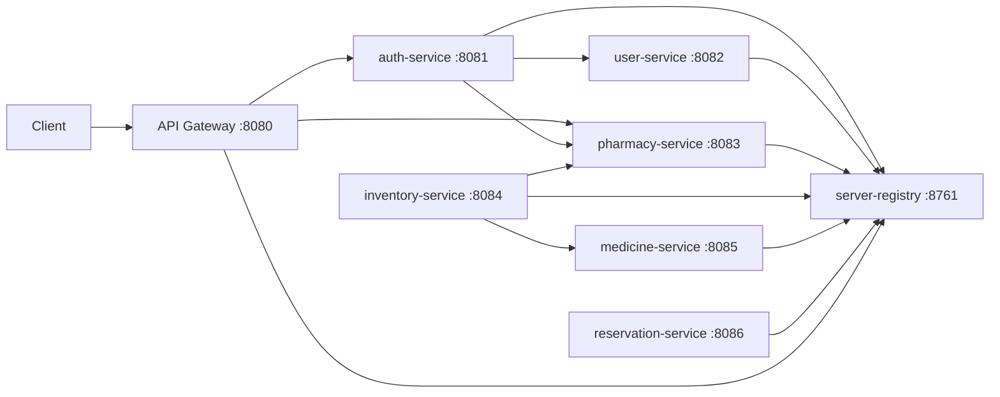

# Pharmase

Pharmase is a Spring Boot microservices backend for a pharmacy platform. The codebase is organized as independent services for authentication, user and pharmacy profile management, medicine catalog search, pharmacy inventory, service discovery, and an API gateway.

This README is based on the current repository structure and source code, not an idealized target architecture. A few modules are production-shaped, while others are still partially scaffolded.

## Project snapshot

- Backend stack: Spring Boot, Spring Cloud, Spring Security, Spring Data JPA, OpenFeign, Eureka
- Database: PostgreSQL
- Auth: JWT plus Google OAuth client flow in `auth-service`
- Build tool: Maven per service
- Java level declared in POMs: `25`

## Services

| Service | Port | Purpose | Current notes |
|---|---:|---|---|
| `server-registry` | `8761` | Eureka service registry | Active and configured as the discovery server |
| `api-gateway` | `8080` | Entry point for routed traffic | Only routes `auth-service` and `pharmacy-service` today |
| `auth-service` | `8081` | Registration, login, JWT validation, Google OAuth setup | Calls `user-service` and `pharmacy-service` to create profiles |
| `user-service` | `8082` | User profile and address management | Source lives under `user-service/user-service` |
| `pharmacy-service` | `8083` | Pharmacy profile and shop validation | Used by auth and inventory flows |
| `inventory-service` | `8084` | Pharmacy-owned medicine inventory | Depends on pharmacy validation and medicine lookup |
| `medicine-service` | `8085` | Searchable medicine catalog | Read-oriented service for medicine lookup |
| `notification-service` | `8085` | Notification service placeholder | Currently only contains the Spring Boot app scaffold |
| `reservation-service` | `8086` | Reservation flow in progress | Has models and security classes, but no controller/service flow yet |

## Architecture



## Implemented API areas

### `auth-service`

Base path: `api/v1`

- `POST /user/register`
- `POST /pharm/register`
- `POST /user/login`
- `POST /pharm/login`
- `GET /user/validate`
- `GET /pharm/validate`
- `GET /hello`

Behavior visible in code:

- Supports local registration/login for both users and pharmacies
- Generates JWTs with role/provider claims
- Creates downstream profile records through Feign after registration
- Includes Google OAuth client dependencies and configuration
- Includes a local rate-limit filter

### `user-service`

Base path: `api/v1/user`

- `POST /create`
- `GET /profile`
- `PUT /profile`
- `GET /address`

Behavior visible in code:

- Creates a minimal profile after successful auth registration
- Stores address, phone, latitude, and longitude
- Validates caller identity through `auth-service`

### `pharmacy-service`

Base path: `api/v1/pharm`

- `POST /create`
- `GET /profile`
- `PUT /profile`
- `GET /is_pharm`
- `GET /is_valid`

Behavior visible in code:

- Stores pharmacy identity and license-related fields
- Exposes a shop-verification check used by inventory flows

### `medicine-service`

Base path: `api/v1/medicine`

- `GET /search_medicine`
- `GET /{id}`

Behavior visible in code:

- Provides search-based medicine lookup
- Returns medicine details by numeric id

### `inventory-service`

Base path: `api/v1/medicine`

- `POST /add_medicine`
- `PUT /update_medicine`
- `GET /medicines`
- `POST /add_medicine/{id}`
- `GET /get_by_id/{id}`

Behavior visible in code:

- Allows a pharmacy account to manage its own medicine inventory
- Verifies pharmacy identity and shop validity through `pharmacy-service`
- Can create inventory entries directly or from a `medicine-service` catalog id

## Running locally

There is no root aggregator POM, so each service is built and run independently.

Suggested startup order:

1. Start PostgreSQL and create the `pharmase` database.
2. Start `server-registry`.
3. Start `api-gateway`.
4. Start `auth-service`.
5. Start `user-service`.
6. Start `pharmacy-service`.
7. Start `medicine-service`.
8. Start `inventory-service`.
9. Start any in-progress services only if you are actively working on them.

Example commands:

```powershell
cd server-registry
./mvnw spring-boot:run
```

```powershell
cd auth-service
./mvnw spring-boot:run
```

Repeat the same pattern for each service directory.

## Configuration

The code expects a local PostgreSQL database:

```text
jdbc:postgresql://localhost:5432/pharmase
```

The repository includes:

- `.gitignore` rules for `**/.env`
- [auth-service/src/main/resources/.env.example](C:\Users\sm803\IdeaProjects\pharmase\auth-service\src\main\resources\.env.example)

Important note:

- Several `application.properties` files currently contain concrete local secrets or passwords in the working tree. Move those values into environment-backed config before using this project anywhere beyond local development.

## Current repo quirks

- `api-gateway` currently defines routes only for `auth-service` and `pharmacy-service`.
- `medicine-service` and `notification-service` are both configured for port `8085`, so they cannot run together without changing one port.
- `notification-service` is only scaffolded at the moment.
- `reservation-service` has security and model classes, but no controller/repository/service workflow is wired yet.
- Some services exist in duplicated nested folders, such as `notification-service/notification-service`, `pharmacy-service/pharmacy-service`, and `user-service/user-service`.
- IntelliJ project files are checked in under `user-service/.idea`.

## Recommended cleanup next

1. Move all secrets out of tracked `application.properties` files.
2. Resolve duplicate module folders and keep one source tree per service.
3. Add gateway routes for the remaining active services.
4. Fix the `8085` port collision between `medicine-service` and `notification-service`.
5. Finish or remove incomplete modules so the architecture is easier to understand.
